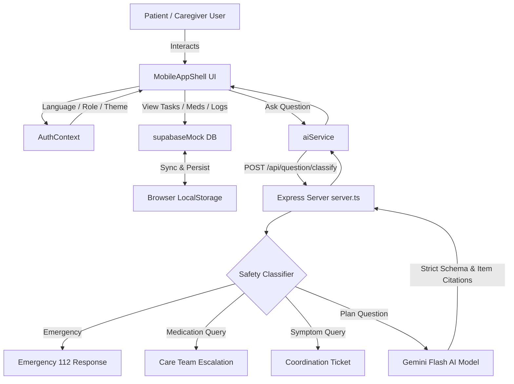

# 🏥 CarePlus — Mobile Patient & Caregiver Follow-Up Coordinator

CarePlus is a mobile-first Progressive Web Application (PWA) designed for post-discharge cardiology recovery, daily treatment adherence, and care-team coordination between patients, family caregivers, and clinical teams.

---

## 📑 Table of Contents
1. [Overview & Clinical Focus](#overview--clinical-focus)
2. [Key Features](#key-features)
3. [Safety & AI Architecture](#safety--ai-architecture)
4. [Technology Stack](#technology-stack)
5. [Directory Structure](#directory-structure)
6. [Data Flow & Architecture Diagram](#data-flow--architecture-diagram)
7. [Installation & Getting Started](#installation--getting-started)
8. [PWA & Mobile Capabilities](#pwa--mobile-capabilities)
9. [Deployment Guide](#deployment-guide)

---

## 🩺 Overview & Clinical Focus

CarePlus was built around real-world clinical discharge protocols (modeled for post-PTCA stenting cardiology patients):
- **Primary Patient**: Lakshmi Devi (68 y/o, post-coronary angioplasty).
- **Dual Personas**: Single-tap toggle between **Patient view** and **Caregiver view** (Ramesh - Son) with permission-restricted actions.
- **Multilingual Support**: Fully translated into **English**, **Hindi (हिंदी)**, and **Tamil (தமிழ்)**.
- **Dual Visual Themes**: 
  - **Clinical Mint (Light Mode)**: High-contrast ice-blue `#EAF4FA` cards, teal accents `#00AFA3`, and dark navy text `#18324A` designed for readability.
  - **Dark Mode**: Dark slate interface for low-light environments.

---

## ✨ Key Features

### 1. 📅 Daily Care Plan & Interactive Timeline
- Categorized timeline for **Appointments**, **Lab Tests**, **Medications**, and **Daily Care**.
- Overdue warnings, status pills, and direct task completion toggles.
- Filter by task category (*All, Appointments, Tests, Care*).

### 2. 💊 Medication Adherence Tracking
- Full prescription schedule with dosage, frequency, and food instructions.
- One-tap **"Mark as Taken"** with instant timestamp logging and undo capability.
- Visual adherence rings and daily progress counters.

### 3. 🤖 Clinical Safety & Ask Assistant (`/ask`)
- Integrated with Google Gemini Flash (`@google/genai`).
- **Deterministic 4-Tier Safety Router**:
  1. 🚨 **Emergency**: Identifies acute cardiac red flags (chest pressure, fainting, severe bleeding) → routes immediately to Emergency Protocol & 112 quick-dial.
  2. 💊 **Medication Safeguard**: Medication alteration queries are strictly blocked from AI generation and escalated directly to Dr. Anita Sharma's team.
  3. 🩺 **Symptom Escalation**: Symptoms (swelling, fever, wound issues) create a Coordination Card for clinical review.
  4. 📋 **Plan QA**: Answers scheduling and follow-up questions citing exact verified discharge plan item IDs.

### 4. 🤝 Care Team Coordination Cards
- Real-time logging of caregiver inquiries, medication delays, appointment rescheduling, and symptom notes.
- Status tracking: `Needs Review`, `Acknowledged`, and `Resolved` with clinical response logs.

### 5. 🚨 Red-Flag Warning Signs & Emergency Quick-Dial
- Verbatim post-discharge emergency signs with visual indicators.
- One-touch **Call 112** integration.

### 6. 🧪 Lab Tests & Diagnostic Records
- Fasting blood sugar, HbA1c, ECG, and echocardiogram status tracking.

### 7. 📍 Find Nearby Care
- Geolocation-aware search for accredited hospitals, pathology labs, and 24/7 pharmacies.

### 8. 🔔 Notification Simulation
- Realistic simulated WhatsApp and SMS reminders for scheduled medication doses and clinic appointments.

### 9. 🖨️ A4 Discharge Summary Export
- Formatted, printable clinical discharge summary suitable for hard-copy filing or secondary doctor reviews.

---

## 🔒 Safety & AI Architecture

```
User Query (Text / Voice)
       │
       ▼
┌──────────────────────────────────────────────┐
│       CarePlus Clinical Safety Router        │
│                (server.ts)                   │
└──────────────────────┬───────────────────────┘
                       │
       ┌───────────────┼───────────────┬────────────────┐
       ▼               ▼               ▼                ▼
 🚨 Emergency    💊 Medication    🩺 Symptom       📋 Plan Question
 (Chest pain,    (Dosage, side    (Swelling, fever, (Appointments,
  bleeding)       effects)         wound checks)     timing, prep)
       │               │               │                │
       ▼               ▼               ▼                ▼
 Instant 112     Direct Care     Coordination      Gemini AI
 Emergency UI    Team Escalation  Card Ticket      with Approved Plan
 & Red Flags     (No AI advice)   Logged           Context & Citations
```

---

## 🛠️ Technology Stack

| Layer | Technology | Purpose |
|---|---|---|
| **Frontend UI** | React 19, TypeScript | Reactive component architecture |
| **Styling** | Tailwind CSS v4, Vanilla CSS variables | Responsive mobile shell & Clinical Mint theme |
| **Icons & Motion** | Lucide React, Motion | Smooth micro-interactions & healthcare iconography |
| **State & Mock DB** | Supabase Mock Service (`supabaseMock.ts`) | Reactive local storage database & event emitter |
| **Backend Server** | Node.js, Express, TSX | Full-stack API server & Vite middleware host |
| **AI Intelligence** | `@google/genai` (Gemini Flash) | Safe, structured plan Q&A coordinator |
| **PWA Engine** | Web App Manifest, Service Worker (`sw.js`) | Offline caching, standalone installation |

---

## 📁 Directory Structure

```
Pateint-Side-App/
├── public/
│   ├── icon.svg               # SVG Vector App Icon
│   ├── icon-192.png           # 192x192 PWA Icon
│   ├── icon-512.png           # 512x512 PWA Icon (Maskable)
│   ├── apple-touch-icon.png   # iOS Safari Web Clip Icon
│   ├── manifest.json          # Web App Manifest specification
│   └── sw.js                  # Service Worker (offline cache & network proxy)
├── scripts/
│   └── generate-icons.js      # Utility script to build PWA compliant PNG icons
├── src/
│   ├── components/
│   │   ├── ask/               # AI Ask chat interface & safety warning banners
│   │   ├── common/            # CoordinationCard, StatusBadge, TopBar, etc.
│   │   ├── layout/            # MobileAppShell, BottomNav, FloatingAction
│   │   ├── medicines/         # MedicineCard & adherence checklist
│   │   ├── pwa/               # PWAInstallButton, usePWAInstall hook
│   │   └── tasks/             # TaskCard, TaskDetailSheet
│   ├── context/
│   │   └── AuthContext.tsx    # Role (Patient/Caregiver), Language, Theme state
│   ├── data/
│   │   └── defaultState.ts    # Seed discharge plan, medications & warnings
│   ├── i18n/
│   │   └── translations.ts    # English, Hindi, and Tamil localization dictionaries
│   ├── services/
│   │   ├── aiService.ts       # Frontend client for question classification
│   │   └── supabaseMock.ts    # Reactive data store with localStorage persistence
│   ├── types/
│   │   └── index.ts           # Shared TypeScript interfaces & models
│   ├── views/
│   │   ├── DashboardView.tsx  # Today's overview, next action, & health metrics
│   │   ├── PlanView.tsx       # Complete categorized recovery plan
│   │   ├── MedicinesView.tsx  # Medication schedule & adherence history
│   │   ├── AskView.tsx        # Clinical assistant Q&A with voice simulation
│   │   ├── MoreView.tsx       # Settings, Warning Signs, Find Care, Reminders
│   │   ├── SettingsView.tsx   # Language switcher, theme picker, PWA installer
│   │   ├── WarningSignsView.tsx # Red flag symptoms & 112 call
│   │   ├── TestsView.tsx      # Diagnostic lab results tracker
│   │   ├── FindCareView.tsx   # Nearby hospitals, clinics, & pharmacies
│   │   ├── RemindersView.tsx  # Simulated WhatsApp & SMS notifications
│   │   └── PrintSummaryView.tsx # Printable A4 discharge document
│   ├── App.tsx                # Main entry routing shell
│   ├── index.css              # Global styles & design system tokens
│   └── main.tsx               # React DOM bootstrap
├── server.ts                  # Express API server + Vite integration
├── vite.config.ts             # Vite configuration with Tailwind & PWA plugin
└── package.json               # Dependencies and build scripts
```

---

## 🔄 Data Flow & Architecture Diagram



---

## 🚀 Installation & Getting Started

### Prerequisites
- **Node.js**: `v18.0.0` or higher (Node 20+ recommended)
- **npm**: `v9.0.0` or higher

### 1. Clone & Install Dependencies
```bash
cd Pateint-Side-App
npm install
```

### 2. Configure Environment Variables
Create a `.env` file in the root of `Pateint-Side-App`:
```env
PORT=3000
GEMINI_API_KEY=your_gemini_api_key_here
```
*(Note: If `GEMINI_API_KEY` is not provided, the server automatically uses deterministic fallback responses for all discharge queries).*

### 3. Start Development Server
```bash
npm run dev
```
Open your browser at: **`http://localhost:3000`**

### 4. Build for Production
```bash
npm run build
npm run start
```

---

## 📱 PWA & Mobile Capabilities

CarePlus is fully configured as an installable standalone Progressive Web App:
- **Android / Chrome / Edge**: One-tap native install prompt directly from **More → Settings → Install CarePlus**.
- **iOS (iPhone / iPad)**: Interactive installation guide (*Safari → Share → Add to Home Screen*).
- **Desktop (Mac / Windows)**: Installable via Chrome / Edge address bar.
- **Offline Support**: `public/sw.js` caches the application shell for instant loading even in spotty network conditions.

---

## 🚢 Deployment Guide

### Deploying to Cloud Providers

#### Option A: Render / Railway (Recommended for Full-stack Express + Vite)
1. Set **Build Command**: `npm install && npm run build`
2. Set **Start Command**: `npm run start`
3. Add Environment Variable: `GEMINI_API_KEY`

#### Option B: Docker
```dockerfile
FROM node:20-alpine
WORKDIR /app
COPY package*.json ./
RUN npm install
COPY . .
RUN npm run build
EXPOSE 3000
CMD ["npm", "run", "start"]
```

---

## 📄 License & Clinical Disclaimer
CarePlus is intended as a clinical coordination and adherence prototype. It does not provide standalone diagnostic determinations or prescribe medications. All medication inquiries are escalated to licensed clinical care teams.
